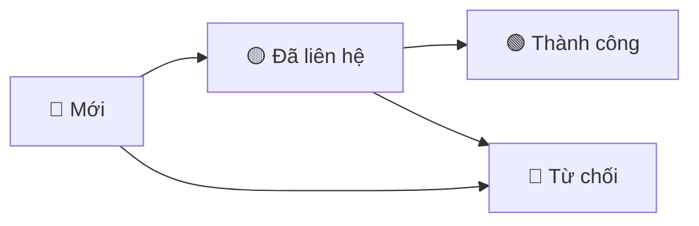

# 📖 Hướng dẫn sử dụng Trang Quản trị LIXIN Admin

> Tài liệu hướng dẫn chi tiết dành cho người quản trị website **lixinvn.com** — bao gồm cách **duyệt bài viết** và **quản lý liên hệ khách hàng**.

---

## 📋 Mục lục

1. [Đăng nhập hệ thống](#1-đăng-nhập-hệ-thống)
2. [Tổng quan Dashboard](#2-tổng-quan-dashboard)
3. [Quản lý và duyệt bài viết (Tin tức)](#3-quản-lý-và-duyệt-bài-viết-tin-tức)
4. [Quản lý liên hệ khách hàng](#4-quản-lý-liên-hệ-khách-hàng)

---

## 1. Đăng nhập hệ thống

### Bước 1: Truy cập trang đăng nhập

Mở trình duyệt và truy cập: **https://lixinvn.com/admin**

Hệ thống sẽ tự động chuyển đến trang đăng nhập nếu bạn chưa đăng nhập.

### Bước 2: Nhập thông tin đăng nhập

| Trường | Nội dung |
|--------|----------|
| **Email** | Nhập email quản trị của bạn |
| **Mật khẩu** | Nhập mật khẩu |

### Bước 3: Bấm nút **"Đăng nhập"**

Sau khi đăng nhập thành công, bạn sẽ được chuyển đến trang **Tổng quan (Dashboard)**.

> [!TIP]
> Nếu bạn quên mật khẩu, hãy liên hệ quản trị viên hệ thống để được cấp lại.

---

## 2. Tổng quan Dashboard

Đây là trang chính sau khi đăng nhập, giúp bạn nắm bắt nhanh tình hình website.

### Các thông tin hiển thị:

| Thẻ thống kê | Ý nghĩa |
|---------------|----------|
| 📰 **Tổng tin tức** | Tổng số bài viết trên hệ thống |
| ✅ **Đã đăng** | Số bài viết đã được xuất bản (hiển thị trên website) |
| 📝 **Bản nháp** | Số bài viết đang ở trạng thái nháp (chưa hiển thị) |
| 📞 **Liên hệ mới** | Số liên hệ khách hàng chưa được xử lý *(bấm để xem chi tiết)* |
| 👥 **Tổng liên hệ** | Tổng số liên hệ đã nhận *(bấm để xem chi tiết)* |
| 🎯 **Chuyển đổi** | Số liên hệ đã chuyển đổi thành khách hàng *(bấm để xem chi tiết)* |

### Thanh menu bên trái:

| Menu | Chức năng |
|------|-----------|
| 📊 **Tổng quan** | Trang chủ quản trị — thống kê tổng quan |
| 📰 **Tin tức** | Quản lý bài viết (thêm, sửa, xóa, duyệt) |
| 📞 **Liên hệ** | Quản lý liên hệ khách hàng |
| ⬅️ **Về trang chủ** | Quay về website chính |

> [!NOTE]
> Phía dưới cùng trang Dashboard có danh sách **"Tin tức mới nhất"** giúp bạn xem nhanh các bài viết gần đây cùng trạng thái.

---

## 3. Quản lý và duyệt bài viết (Tin tức)

### 3.1. Xem danh sách bài viết

Bấm **"📰 Tin tức"** trên thanh menu bên trái.

#### Giải thích giao diện:

| Thành phần | Mô tả |
|-----------|-------|
| **Tab "Tất cả"** | Hiển thị toàn bộ bài viết |
| **Tab "Đã đăng"** | Chỉ hiển thị bài đã xuất bản |
| **Tab "Bản nháp"** | Chỉ hiển thị bài chưa xuất bản |
| **Nút "+ Thêm tin mới"** | Tạo bài viết mới (góc trên phải) |
| **Cột TRẠNG THÁI** | 🟢 **Đã đăng** = hiển thị trên web, 🟡 **Nháp** = chưa hiển thị |
| **Nút "Sửa"** | Mở bài viết để chỉnh sửa nội dung |
| **Nút "Xóa"** | Xóa bài viết khỏi hệ thống |

---

### 3.2. Chỉnh sửa và duyệt bài viết

Bấm **"Sửa"** tại bài viết cần duyệt. Trang chỉnh sửa sẽ hiện ra:

#### Các trường thông tin:

| Trường | Mô tả |
|--------|-------|
| **Tiêu đề** | Tiêu đề bài viết |
| **Tóm tắt** | Mô tả ngắn, hiển thị ở trang danh sách tin tức |
| **Nội dung** | Nội dung chi tiết bài viết, sử dụng trình soạn thảo với thanh công cụ (in đậm, nghiêng, heading, danh sách, link, hình ảnh, bảng...) |

#### Tab ngôn ngữ:

Bài viết hỗ trợ **3 ngôn ngữ**: 🇻🇳 **Tiếng Việt**, 🇬🇧 **English**, 🇨🇳 **中文**. Bấm vào tab tương ứng để nhập nội dung từng ngôn ngữ.

---

### 3.3. Đăng bài (Duyệt bài)

Cuộn xuống phần dưới của trang chỉnh sửa:

#### Cách duyệt bài (xuất bản):

1. **Kiểm tra nội dung bài viết** (tiêu đề, tóm tắt, nội dung)
2. Chọn **Danh mục** phù hợp (Kế toán, Pháp lý...)
3. Thêm **URL ảnh đại diện** nếu cần
4. Bấm nút **🔴 "Đăng bài"** → Bài viết sẽ được xuất bản lên website

#### Các nút hành động:

| Nút | Chức năng | Khi nào dùng |
|-----|-----------|-------------|
| 🔴 **Đăng bài** | Xuất bản bài viết lên website | Khi nội dung đã hoàn chỉnh, sẵn sàng hiển thị |
| ⚪ **Lưu nháp** | Lưu bài nhưng chưa xuất bản | Khi nội dung chưa hoàn chỉnh, cần chỉnh sửa thêm |
| ⚪ **Hủy** | Hủy bỏ thay đổi | Khi không muốn lưu |
| 🔴 **Xóa bài** | Xóa hoàn toàn bài viết | Khi bài viết không còn cần thiết |

> [!IMPORTANT]
> Khi bấm **"Đăng bài"**, bài viết sẽ hiển thị **ngay lập tức** trên website cho tất cả người dùng thấy. Hãy kiểm tra kỹ nội dung trước khi đăng!

> [!TIP]
> Nếu bài viết cần chỉnh sửa sau khi đã đăng, bạn có thể bấm **"Sửa"** bất kỳ lúc nào và bấm **"Lưu nháp"** để tạm ẩn bài khỏi website.

---

## 4. Quản lý liên hệ khách hàng

### 4.1. Xem danh sách liên hệ

Bấm **"📞 Liên hệ"** trên thanh menu bên trái.

#### Giải thích giao diện:

| Thành phần | Mô tả |
|-----------|-------|
| **Tiêu đề** | Hiển thị tổng số liên hệ và số liên hệ mới (màu xanh) |
| **Ô tìm kiếm** | Tìm theo tên, số điện thoại, hoặc email |
| **Bộ lọc trạng thái** | Lọc theo: Tất cả / 🔵 Mới / 🟡 Đã liên hệ / 🟢 Thành công / 🔴 Từ chối |
| **Bộ lọc dịch vụ** | Lọc theo loại dịch vụ: Tất cả / Chung / Kế toán / Khác |
| **Nút "Tìm kiếm"** | Thực hiện tìm kiếm (hoặc nhấn Enter) |

#### Bảng danh sách:

| Cột | Nội dung |
|-----|----------|
| **KHÁCH HÀNG** | Tên khách hàng + tin nhắn (nếu có) |
| **LIÊN HỆ** | Số điện thoại + email |
| **DỊCH VỤ** | Loại dịch vụ khách hàng quan tâm |
| **TRẠNG THÁI** | 🔵 Mới / 🟡 Đã liên hệ / 🟢 Thành công / 🔴 Từ chối |
| **NGÀY GỬI** | Ngày và giờ khách hàng gửi form |
| **THAO TÁC** | Nút **"Chi tiết"** để xem và xử lý |

> [!NOTE]
> Các liên hệ có trạng thái **"Mới"** sẽ được **highlight nền xanh nhạt** để dễ nhận biết.

---

### 4.2. Xem chi tiết và xử lý liên hệ

Bấm **"Chi tiết"** tại liên hệ cần xử lý. Cửa sổ chi tiết sẽ hiện ra:

#### Thông tin hiển thị:

| Mục | Mô tả |
|-----|-------|
| **Tên + Thời gian** | Tên khách hàng và thời điểm gửi liên hệ |
| **Số điện thoại** | Có thể bấm để gọi trực tiếp |
| **Email** | Email khách hàng (nếu có) |
| **Dịch vụ** | Loại dịch vụ khách quan tâm |
| **Nguồn** | Nơi khách hàng gửi liên hệ (website, landing page...) |
| **Tin nhắn** | Nội dung tin nhắn từ khách hàng |

---

### 4.3. Cập nhật trạng thái liên hệ

Trong cửa sổ chi tiết, phần **"Trạng thái"** có 4 nút cho phép bạn thay đổi:

| Trạng thái | Ý nghĩa | Khi nào chọn |
|------------|----------|-------------|
| 🔵 **Mới** | Liên hệ vừa nhận, chưa xử lý | Mặc định khi khách hàng gửi form |
| 🟡 **Đã liên hệ** | Đã gọi điện/gửi email cho khách hàng | Khi bạn đã liên hệ lại với khách nhưng chưa có kết quả |
| 🟢 **Thành công** | Khách hàng đã đồng ý sử dụng dịch vụ | Khi đã chốt được khách hàng |
| 🔴 **Từ chối** | Khách hàng không quan tâm | Khi khách hàng từ chối hoặc không liên lạc được |

#### Các bước cập nhật:

1. **Bấm vào trạng thái** muốn chuyển (ví dụ: "Đã liên hệ")
2. Nhập **Ghi chú nội bộ** (không bắt buộc) — dùng để ghi lại thông tin trao đổi với khách
3. Bấm nút **"💾 Lưu thay đổi"**
4. Thông báo **"✅ Đã lưu thay đổi thành công!"** sẽ hiện ở góc dưới phải

> [!TIP]
> **Ghi chú nội bộ** rất hữu ích để ghi lại: 
> - Kết quả cuộc gọi với khách hàng
> - Ngày hẹn gặp mặt
> - Yêu cầu đặc biệt của khách
> - *Chỉ admin mới thấy ghi chú này, khách hàng không thấy*

---

### 4.4. Tìm kiếm và lọc liên hệ

#### Tìm kiếm nhanh:
1. Nhập tên, số điện thoại, hoặc email vào **ô tìm kiếm**
2. Bấm **"Tìm kiếm"** hoặc nhấn phím **Enter**

#### Lọc theo trạng thái:
1. Bấm vào dropdown **"Tất cả trạng thái"**
2. Chọn trạng thái muốn lọc: 🔵 Mới / 🟡 Đã liên hệ / 🟢 Thành công / 🔴 Từ chối

#### Lọc theo dịch vụ:
1. Bấm vào dropdown **"Tất cả dịch vụ"**
2. Chọn loại dịch vụ: Chung / Kế toán / Khác

> [!NOTE]
> Bạn có thể **kết hợp nhiều bộ lọc** cùng lúc. Ví dụ: tìm tất cả liên hệ mới về dịch vụ kế toán.

---

## 📌 Quy trình xử lý liên hệ khuyến nghị

| Bước | Hành động | Ghi chú |
|------|-----------|---------|
| 1 | Kiểm tra liên hệ **Mới** hàng ngày | Vào Dashboard xem số "Liên hệ mới" |
| 2 | Gọi điện / gửi email cho khách | Chuyển trạng thái → **"Đã liên hệ"** |
| 3 | Ghi lại kết quả cuộc trao đổi | Nhập vào **"Ghi chú nội bộ"** |
| 4 | Cập nhật kết quả cuối cùng | → **"Thành công"** hoặc **"Từ chối"** |

> [!IMPORTANT]
> Nên kiểm tra liên hệ mới **ít nhất 1 lần mỗi ngày** để không bỏ lỡ khách hàng tiềm năng!

---

## ❓ Câu hỏi thường gặp

### Q: Bài viết đã đăng nhưng muốn ẩn?
**A:** Vào **Tin tức** → bấm **"Sửa"** → bấm **"Lưu nháp"**. Bài sẽ chuyển về trạng thái nháp và không hiển thị trên website.

### Q: Liên hệ bị cập nhật sai trạng thái?
**A:** Bạn có thể thay đổi lại bất kỳ lúc nào bằng cách bấm **"Chi tiết"** → chọn trạng thái đúng → bấm **"Lưu thay đổi"**.

### Q: Có thể xóa liên hệ không?
**A:** Hiện tại hệ thống không hỗ trợ xóa liên hệ để đảm bảo không mất dữ liệu. Bạn có thể đánh dấu là **"Từ chối"** cho các liên hệ không cần thiết.

### Q: Ghi chú nội bộ có ai thấy không?
**A:** Không. Ghi chú nội bộ chỉ hiển thị cho người quản trị, khách hàng **không thể thấy** ghi chú này.

---

> 📅 *Cập nhật lần cuối: 28/02/2026*
> 
> 📧 *Liên hệ hỗ trợ kỹ thuật: admin@lixinvn.com*
